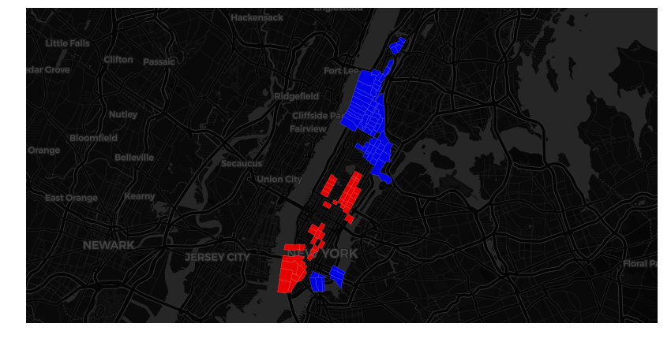

## Spatial Analysis

### About this Guide

This guide walks you through methods to implement spatial analysis using CARTOframes. CARTOframes provides `query` and `QueryLayer` functions to run spatial analysis based on PostgreSQL and PostGIS. Users can receive query results as `pandas.DataFrame` format as well as demonstrate them in maps.

### Getting Started

To get started, create `CartoContext` and load *New York City Census Tract Boundary (2015)* and *New York City McDonalds' Locations* datasets before running the example codes in this guide.
```python
from cartoframes import CartoContext, QueryLayer, BaseMap
cc = CartoContext(base_url='your base url',
                  api_key='your api key')
```

For *New York City Census Tract Boundary (2015)*, you can either download it from [US Census Bureau](https://www.census.gov/cgi-bin/geo/shapefiles/index.php) or use CARTOframes `data_boundaries` function to request it from CARTO Data Observatory (DO). Check [next guide](./04-Data-Observatory) for more DO interactions within cartoframes.
```python
# request census tract geometry form us.census.tiger.census_tract
# filtered by the rough bounding box of New York City
tracts = cc.data_boundaries(
        boundary='us.census.tiger.census_tract',
        region=[-74.2589, 40.4774, -73.7004, 40.9176],
        timespan='2015')

# filtered by Federal Information Processing Standards (FIPS) County Code
# '36' is the FIPS code for New York State;
# '005', '047', '061', '081' and '085' are the FIPS codes for five boroughs in New York City
nyc_counties = ['36005', '36047', '36061', '36081', '36085']
nyc_ct = tracts[list(map(lambda x: str(x)[:5] in nyc_counties, tracts.geom_refs))]
```

For *New York City McDonalds' Locations* data, load it from CARTOframes `example` datasets.
```python
mcd = cc.example.load_nycMcdonalds()
```
Then write both datasets to your CARTO account.
```python
cc.write(nyc_ct, 'nyc_census_tracts')
cc.write(mcd, 'nyc_mcdonalds')
```

### Running a SQL query
Use `query` function to run SQL query for the datasets in your CARTO account. PostGIS includes multiple spatial analysis functions like `ST_Intersects`, `ST_buffer`. Also, [CARTO Crankshaft](https://github.com/CartoDB/crankshaft/tree/develop/doc) provides additional advanced spatial analysis functions like `cdb_kmeans`, `cdb_moransilocal`.

#### Example 1
```python
# Find the number of McDonald's
# In each census tract in New York City
df = cc.query("""
    SELECT tracts.geom_refs AS FIPS_code, COUNT(mcd.*) AS num_mcdonalds
    FROM nyc_census_tracts As tracts, nyc_mcdonalds As mcd
    WHERE ST_Intersects(tracts.the_geom, mcd.the_geom)
    GROUP BY tracts.geom_refs
    ORDER BY num_mcdonalds DESC
""")

# Show first five entries of results
# Including FIPS code (unique digital identifier for census tracts) and the number of McDonald's
# Sorted by the number of McDonald's in descending order
df.head()

#         fips_code	  num_mcdonalds
# 0	  36061010100	     4
# 1	  36061007100	     2
# 2	  36061011300	     2
# 3	  36061010900	     2
# 4	  36061001502	     2

```

|      |  fips_code  | num_mcdonalds |
| :--: | :---------: | :-----------: |
|  0   | 36061010100 |       4       |
|  1   | 36061007100 |       2       |
|  2   | 36061011300 |       2       |
|  3   | 36061010900 |       2       |
|  4   | 36061001502 |       2       |
** TO-DO: which one is better? markdown table or code comment**


#### Example 2
```python
# Build 100 meters buffer area for each McDonald's.
# Either update 'the_geom'
# (Be Careful! This will change the original table in your account)
cc.query("""
    UPDATE nyc_mcdonalds
    SET the_geom = ST_Buffer(the_geom::geography, 100)::geometry
""")
df = cc.query("""
    SELECT name, id, address, city, zip, the_geom
    FROM nyc_mcdonalds
""",
    decode_geom=True)

# or Creat a new table and save it as 'nyc_mcdonalds_buffer_100m'.
df = cc.query("""
    SELECT name, id, address, city, zip,
           ST_Buffer(the_geom::geography, 100)::geometry AS the_geom
    FROM nyc_mcdonalds
""",
    table_name='nyc_mcdonalds_buffer_100m')

# Show the first entry.
# 'geomtery' is Polygon type now.
df = cc.read('nyc_mcdonalds_buffer_100m', decode_geom=True)
df.iloc[0, :]

# address                                    1101 E Tremont Ave
# city                                                    Bronx
# id                                                        233
# name                                               McDonald's
# the_geom    0106000020E61000000100000001030000000100000021...
# zip                                                     10460
# geometry    (POLYGON ((-73.87570453921256 40.8403982178504...
```
**To Do: instead of showing the returned Dataframe here, better to show the screenshot map using CARTOframes, like the one in issue 408**

### Maping a SQL query
Use table names or `QueryLayer` inside `map` function to demonstrate analysis results.


#### Example 3
```python
# Apply KMeans (k=5) method
# Spatial Clustering for all McDonald's in NYC
# Visualize different clusters by color

tmp = cc.query("""
       SELECT
         row_number() over() AS cartodb_id,
         c.cluster_no,
         c.the_geom,
         ST_Transform(c.the_geom, 3857) AS the_geom_webmercator
       FROM
         ((SELECT * FROM cdb_crankshaft.cdb_kmeans('SELECT the_geom, cartodb_id, longitude, latitude FROM nyc_mcdonalds', 5)) a
           JOIN
         nyc_mcdonalds b
         ON
         a.cartodb_id = b.cartodb_id
         ) c
              """,
             table_name='tmp')

cc.map(Layer("tmp", color={'column': 'cluster_no',
                           'scheme': styling.prism(5)}),
      interactive = True)             
```


Users also can drop temporary tables using `delete` function after map plotting.
```python
cc.delete('tmp')
```

#### Example 4
```python
# Apply Moran's I Analysis
# Detect Hot Spots & Cold Spots of
# Median Household Income at Census Tract Level
# In Manhattan

# Augment median_household_income data from DO
median_income = [{'numer_id': 'us.census.acs.B19013001',
                  'geom_id': 'us.census.tiger.census_tract',
                  'numer_timespan': '2011 - 2015'}]
df = cc.data('nyc_census_tracts', median_income)

# Filter census tracts from Manhattan.
# Keep those whose 'median_income_2011_2015' values aren't 'NaN'.
df['isManhattan'] = df.apply(lambda x: x.geom_refs.startswith("36061"), axis=1)
manhattan = df[df['isManhattan'] == True]
manhattan.dropna(subset=['median_income_2011_2015'], inplace=True)

# Save the dataframe to your CARTO account
cc.write(manhattan, 'manhattan_median_income', overwrite=True)

# Check crankshaft documentation for more information of 'cdb_moransilocal' function
tmp = cc.query("""
            SELECT m.*, t.the_geom, t.the_geom_webmercator, t.cartodb_id
            FROM cdb_crankshaft.cdb_moransilocal('SELECT * FROM manhattan_median_income', 'median_income_2011_2015') as m
            JOIN manhattan_median_income as t
            ON t.cartodb_id = m.rowid
            """)
cc.write(tmp, 'tmp', overwrite=True)

# The map shows Hot Spots in 'red' and Cold Spots in 'blue'
cc.map(layers=[
    BaseMap('dark'),
    QueryLayer("""
            select * from tmp
            where significance < 0.05 and (quads = 'LL' or quads ='HH')
            """,
            color={'column': 'quads',
                   'scheme': styling.custom(colors=["blue", "red"],
                                            bin_method='category' )})],
    interactive = False)
```
** TO Do: the styling code might be misleading. Actually can not detect "HH": 'red' and "LL": 'blue' barely from the code itself. The order of colors in `styling.custom` doesn't change anything about the correspondence **


